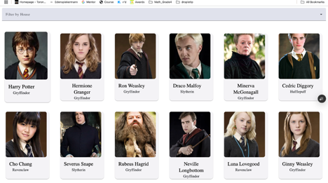
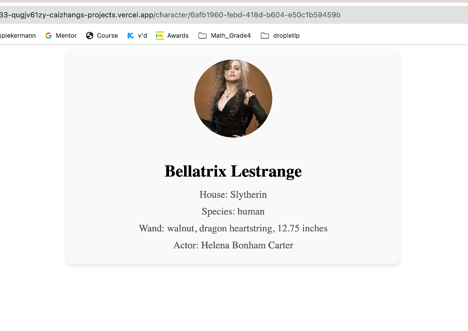
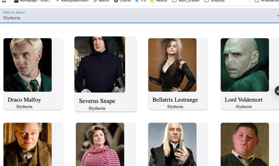

# 101464891LabTest2Comp3133


[](https://angular.io/)
[](LICENSE)

A magical Angular application showcasing Hogwarts characters with house filtering and detailed profiles using the official Harry Potter API.




## Key Features ✨
- 🏰 **House Filtering**: Sort characters by Hogwarts houses
- 🔍 **Detailed Profiles**: Wand specs, ancestry, and actor information
- 🖼️ **Character Gallery**: Responsive grid layout
- 🌐 **Real API Data**: Powered by [HP-API](https://hp-api.onrender.com)

## Installation ⚡
```bash
git clone https://github.com/caizhang-0416/labtest2_comp3133.git
cd 101464891-lab-test2-comp3133
npm install
ng serve
